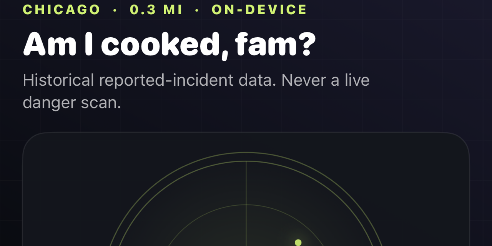
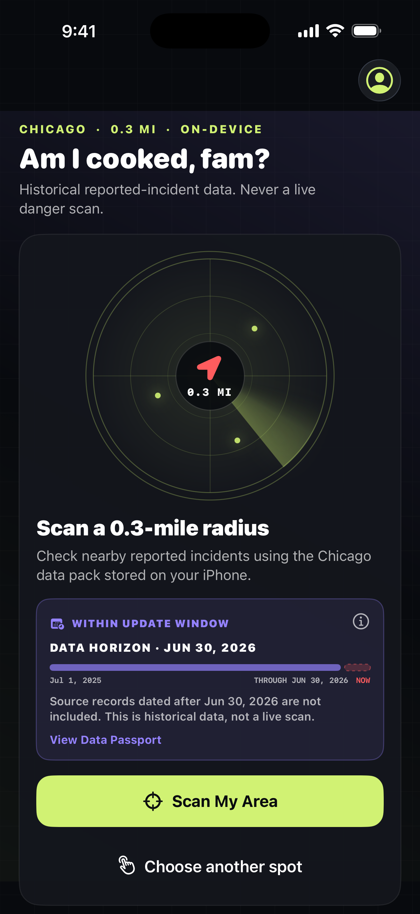
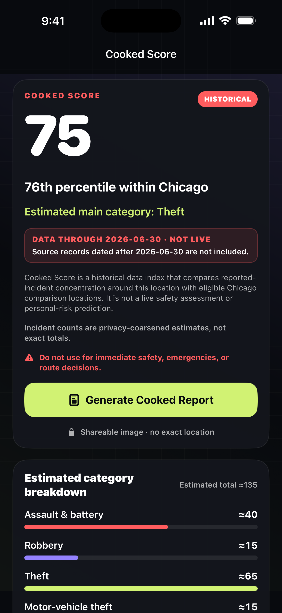
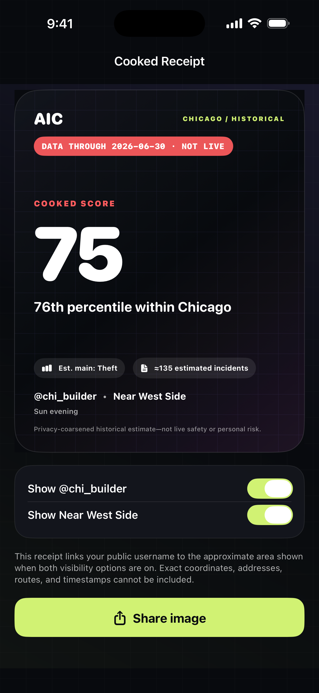

# Am I Cooked?



Am I Cooked? (AIC) is a privacy-first iOS application that turns official
Chicago historical reported-incident data into a locally calculated,
descriptive **Cooked Score**.

The app is designed around a deliberately narrow promise: users can compare a
location with eligible Chicago reference locations without sending their
coordinates, pins, routes, addresses, or scan history to AIC services. It is
not a live safety assessment or a prediction of personal risk.

## Product tour

The Home screen states the product boundary before the first scan. The primary
flow works without an account, makes both location choices explicit, and confirms
that the Chicago data pack and scoring operation remain on-device. Sign in with
Apple is optional in Settings for account and public-username features.

<p align="center">
  
  
  
</p>

## What I built

- A SwiftUI iOS client with optional Sign in with Apple, username onboarding, local
  location/manual-pin scanning, results, receipts, settings, logout, and
  account deletion.
- A deterministic Python pipeline that transforms official Chicago data into a
  compact, privacy-coarsened SQLite pack shipped with the app.
- A Cloudflare Worker account service with encrypted Apple credential storage,
  rotating refresh tokens, replay defenses, rate limits, deletion proofs, and
  durable Apple-token revocation handling.
- Reproducible methodology, privacy, security, and cross-language parity tests.
- Static privacy, support, methodology, deletion, and terms pages for App Store
  distribution requirements.

## Architecture

```text
City of Chicago open data
        |
        v
Deterministic Python pack builder
        |
        v
Privacy-coarsened SQLite pack -----> SwiftUI app
                                         |
                                         | account operations only
                                         | (never scan coordinates)
                                         v
                              Cloudflare account Worker
                                         |
                              Sign in with Apple + D1
```

The scoring path is local. The account service receives authentication and
profile operations, but it has no location, scan, route, address, or receipt
endpoint.

## Privacy properties

- Each eligible source event influences at most one 250 m cell and one
  supported category.
- Category counts are independently rounded to the nearest five.
- The shipped pack contains no incident coordinates, source IDs, addresses,
  timestamps, exact cell totals, or scan history.
- Cooked Receipts are rendered locally and exported without EXIF, GPS, or
  ancillary PNG metadata.
- Sessions are stored in the iOS Keychain using
  `kSecAttrAccessibleWhenUnlockedThisDeviceOnly`.

The complete scoring and disclosure method is documented in the
[Chicago schema-v3 methodology](docs/methodology/BETA_SCORE.md).

## Security design

The account service validates Apple issuer, audience, signature, token age,
subject, and hashed nonce. AIC refresh tokens are random opaque values stored
only as hashes and rotated on use. Account deletion requires a fresh,
account-bound, one-time proof and handles authorization-token races through a
bounded encrypted revocation outbox.

External build inputs are schema-, domain-, complexity-, size-, and
cardinality-bounded before they can affect release artifacts.

See [`SECURITY.md`](SECURITY.md) for reporting instructions and supported
security boundaries.

## Verification

From the repository root:

```bash
python3 -m unittest discover -s pipeline/tests -v
(cd services/account-worker && npm test)
(cd ios && swift test)
```

Current local verification:

- Python pack pipeline: 15 tests
- Cloudflare account service: 28 tests
- Swift core package: 17 tests
- Production npm dependency audit: 0 known vulnerabilities
- Full Git-history secret scan: 0 findings

## Repository map

| Path | Purpose |
| --- | --- |
| `ios/` | SwiftUI client, local scoring core, and iOS tests |
| `services/account-worker/` | Cloudflare Worker account API and tests |
| `pipeline/` | Reproducible Chicago data-pack builder and tests |
| `data/` | Released aggregate pack, manifest, checksums, and parity fixtures |
| `docs/methodology/` | Score, source, privacy, and IUCR methodology |
| `web/public/` | Privacy, terms, support, deletion, and methodology pages |
| `distribution/app-store/` | App Store metadata and review documentation |

## Data sources

The pipeline uses official City of Chicago/Chicago Police Department datasets.
Source links, transformations, attribution, privacy handling, and terms are
listed in [`DATA_SOURCES.md`](DATA_SOURCES.md).

## Project ownership and AI assistance

This is a personal portfolio project owned and directed by **Binh Nguyen**.
Development was AI-assisted. Product scope, privacy requirements, architecture,
review criteria, validation, and release decisions were directed by the project
owner; generated work was reviewed and tested before acceptance.

That disclosure is intentional: the engineering value of this project is in
the system design, privacy boundaries, threat-driven implementation, and
verification—not in pretending the tools were different from those actually
used.

## Status

The repository represents a Chicago-first App Store release candidate and
engineering portfolio project. It is not a live public-safety service.

Licensed under the [MIT License](LICENSE).
